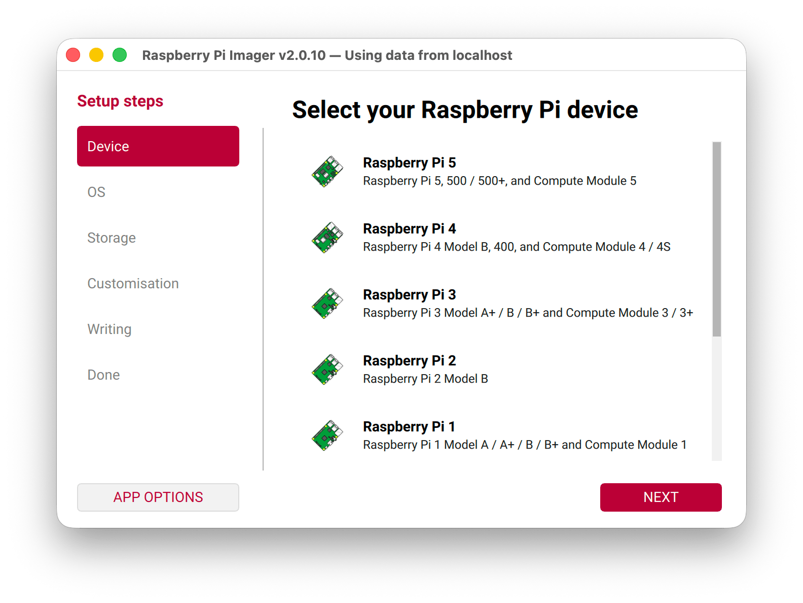
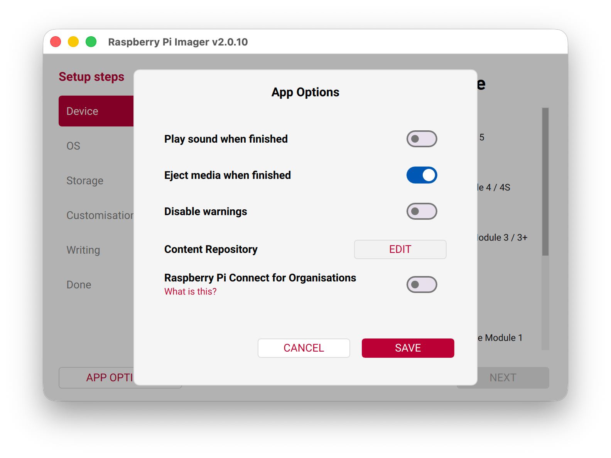
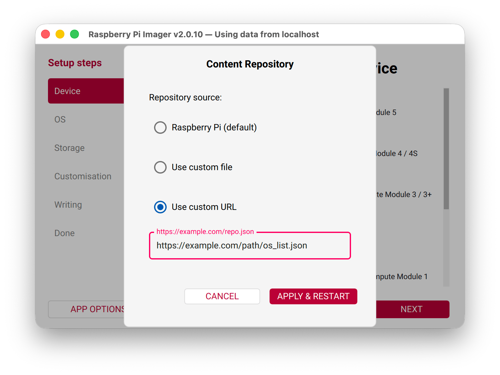
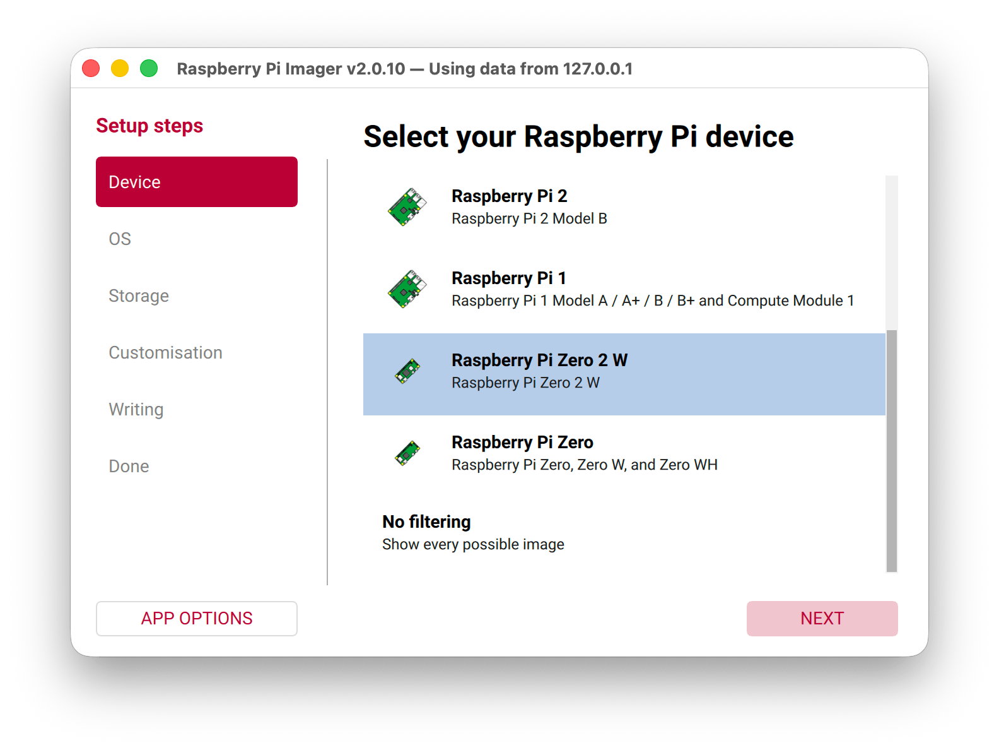
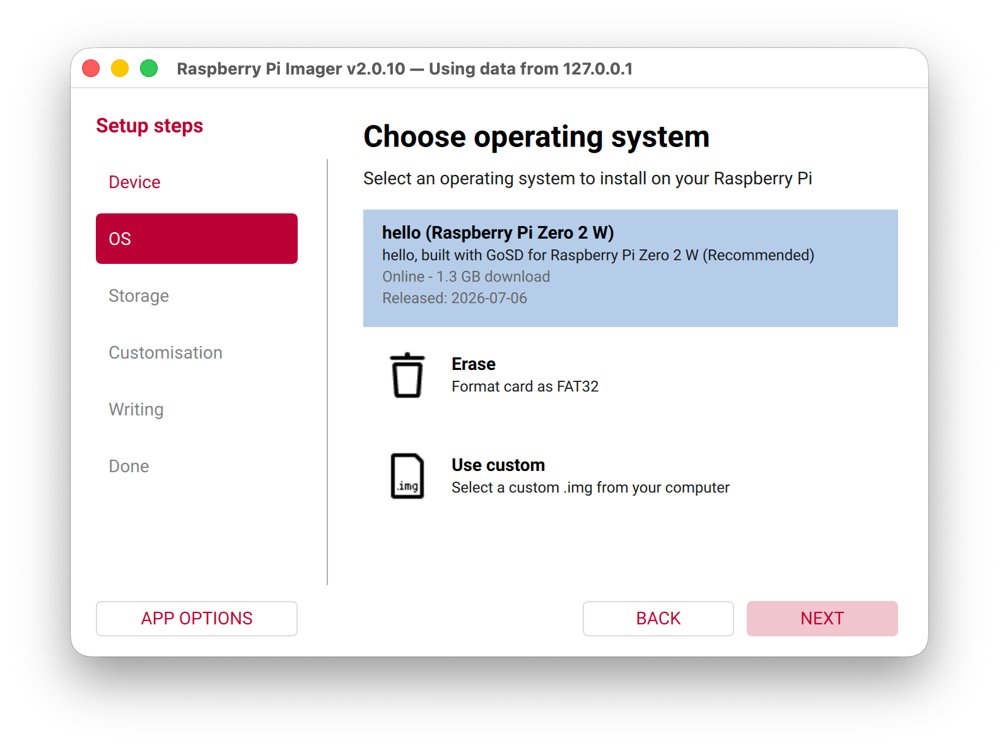
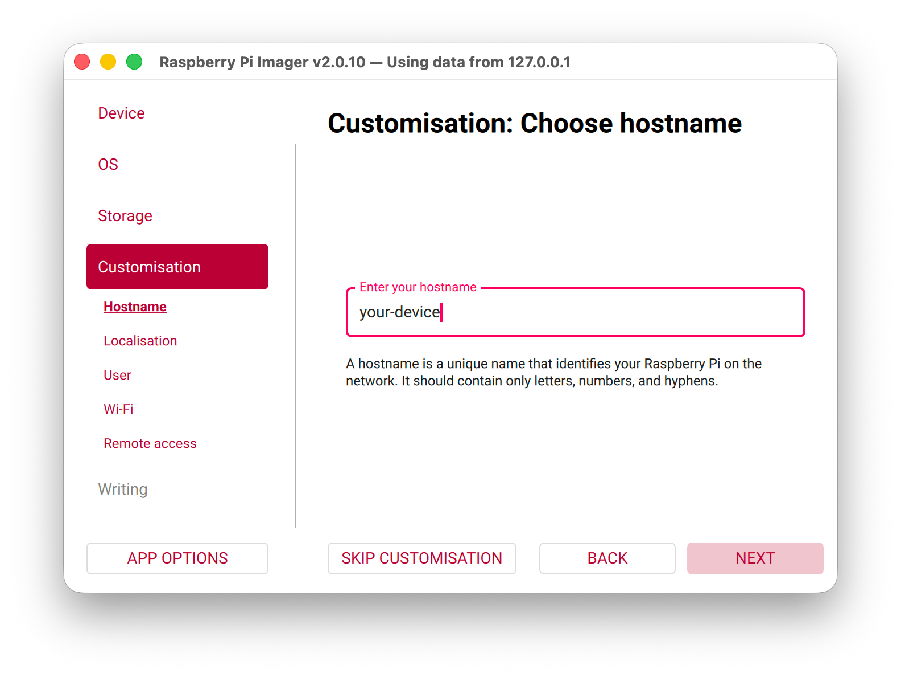
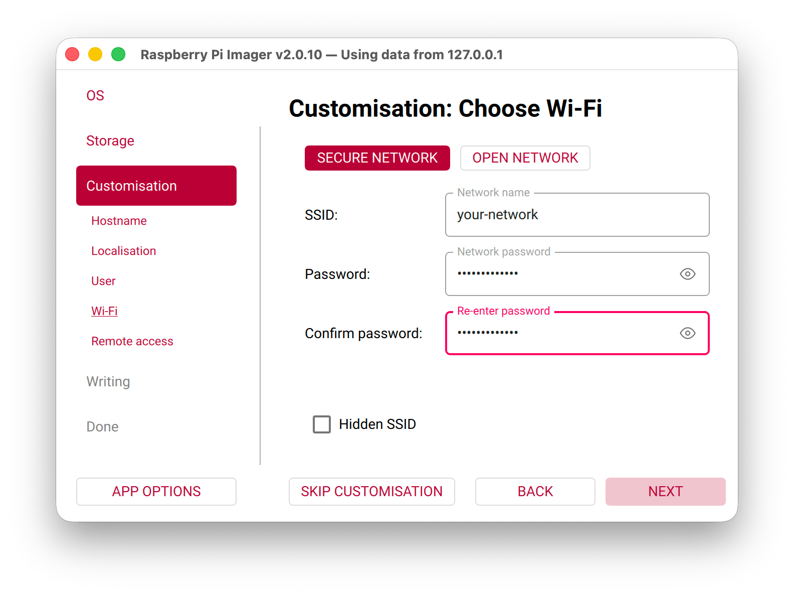

# Putting an app onto your Raspberry Pi

This guide walks you through copying an app onto a memory card ("SD card")
using a program called **Raspberry Pi Imager**, so a small computer — a
Raspberry Pi — can run it. You don't need to use a terminal or type any
commands. You'll need:

- A Raspberry Pi Zero 2 W (or another board your app's developer told you
  it supports)
- A microSD memory card (8GB or larger) and, if your computer doesn't have
  a card slot, a USB card reader
- A link (URL) to the app, given to you by whoever built it — it'll look
  something like `https://example.com/path/os_list.json`
- A WiFi network name and password, if your device connects over WiFi

If your board connects with a network cable instead of WiFi (check with
whoever gave you the app if you're not sure), you can skip the WiFi step
below and just plug the cable in before you power it on.

## 1. Install Raspberry Pi Imager

Download and install [Raspberry Pi Imager](https://www.raspberrypi.com/software/)
— it's free, and available for Windows, Mac, and Linux. Open it once it's
installed.

## 2. Open the app options

In the bottom-left corner of the window, click the button labeled **APP
OPTIONS**.



## 3. Find "Content Repository"

A window opens with several settings in it. Find **Content Repository** and
click the **EDIT** button next to it.



## 4. Enter the link you were given

Choose **Use custom URL**, then paste the link your app's developer gave
you into the box underneath. Click **APPLY & RESTART**.



## 5. Pick your device

Imager reopens and asks you to choose your device. Find and select the
board you were told to use — for example, **Raspberry Pi Zero 2 W** — then
click **NEXT**.



If your board isn't a Raspberry Pi (for example, a Radxa Zero 3E), it won't
be in this list by name — scroll to the bottom and choose **No filtering**
instead, which shows every available app regardless of device.

## 6. Choose the app

The next screen lists the app(s) available at the link you entered. Select
the one you want — its name will match what your developer told you — and
click **NEXT**.



Don't pick **Use custom** here — that's for loading a file straight from
your computer, and it skips the setup wizard in the next two steps.

## 7. Choose a name for your device

You'll be asked to give your device a name (a "hostname"). This is the name
you'll use to find it later, once it's up and running — pick something
short and memorable, using only letters, numbers, and hyphens.



## 8. Enter your WiFi details

If your device connects over WiFi, enter your network's name and password
here (skip this step if you're using a network cable instead). Imager saves
these details onto the memory card, so your device will reconnect to this
network automatically every time it's turned on — you won't need to enter
this again unless you change WiFi networks later.



## 9. Write the card

Continue through the remaining steps (Imager may ask which memory card to
use, if you have more than one plugged in) and click through to **Write**.
This copies the app onto your memory card — it can take a few minutes,
depending on the size of the app and the speed of your card. Don't remove
the card while this is happening; Imager will tell you when it's safe to do
so.

## 10. Power it on

Put the memory card into your device and connect it to power. You don't
need a screen, keyboard, or mouse — everything happens automatically. Give
it a minute or two: it needs a little time to start up and join your WiFi
network (if you're using one) before it's ready.

## 11. Find your device

From a phone, tablet, or computer connected to the **same network**, open a
web browser and go to:

```
http://<the name you chose>.local
```

For example, if you named your device `my-lamp`, go to `http://my-lamp.local`.
Your app should appear.

## Troubleshooting

**The app doesn't appear in the list (step 6).** Double-check the link you
entered in step 4 for typos. If your device isn't a Raspberry Pi, make sure
you chose **No filtering** in step 5, rather than a specific device — see
the note under that step above.

**`http://<name>.local` doesn't load.** Give it another minute — it can
take a little while to join the network the first time. If it still
doesn't work, open your WiFi router's admin page (check its manual, or the
label on the router itself) and look for a list of connected devices; your
device should appear there by name, along with a numeric address you can
use instead (e.g. `http://192.168.1.42`).

**You typed the wrong WiFi password.** This is easy to fix without
redoing anything:

1. Take the memory card out of the device and put it back into your
   computer.
2. A drive named **GOSD-BOOT** should appear, the same way a USB stick
   would. Open it.
3. Inside, you'll find a file called `gosd.toml` — open it with any plain
   text editor (Notepad on Windows, TextEdit on a Mac, or similar). The
   file itself explains, in plain language at the top, exactly what to
   change and how to save it.
4. Update the WiFi name and password, save the file, then put the card
   back in your device and turn it on (or restart it) — your changes take
   effect the next time it starts up.

This same file is also the fallback if you ever need to change your
device's name or WiFi details without going through Imager again.

**Extra settings.** Some apps need a bit of extra information to work the
way you want — the same `gosd.toml` file above may have a section for
these near the bottom, with its own plain-language instructions. If your
app's developer told you to set something there, that's the file and the
section they mean; if not, you can ignore it.

---

## For developers: linking your users here

If you're publishing an app built with GoSD, you can point your users
straight at this guide (or copy the steps into your own project's README).
A short version to paste in:

```md
## Installing <YourApp> on a Raspberry Pi

1. Install [Raspberry Pi Imager](https://www.raspberrypi.com/software/).
2. Open **App options** → **Content Repository** → **Use custom URL**, and
   paste in: `https://<your-hosted-url>/os_list.json`
3. Choose your device, then choose **<YourApp>** from the list.
4. Give your device a name and (if it uses WiFi) your network details.
5. Write the card, then plug it into your device and power it on.
6. After a minute or two, visit `http://<the name you chose>.local`.

Full walkthrough with screenshots: [docs/flashing.md](https://github.com/jphastings/gosd/blob/main/docs/flashing.md)
```

See [`docs/publishing.md`](publishing.md) for how to host the files this
link points to.
